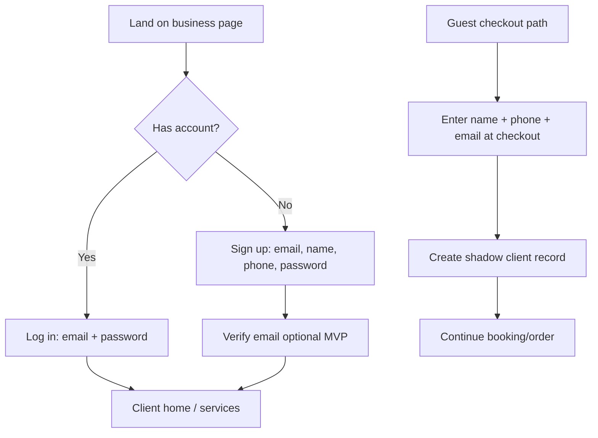
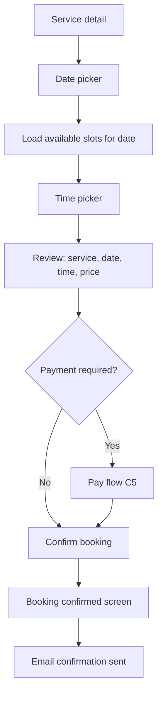
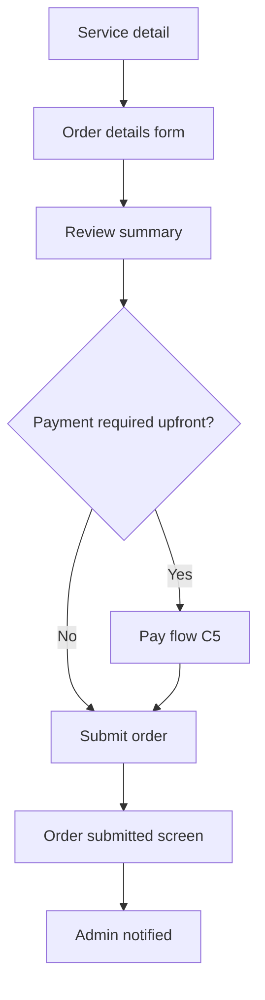
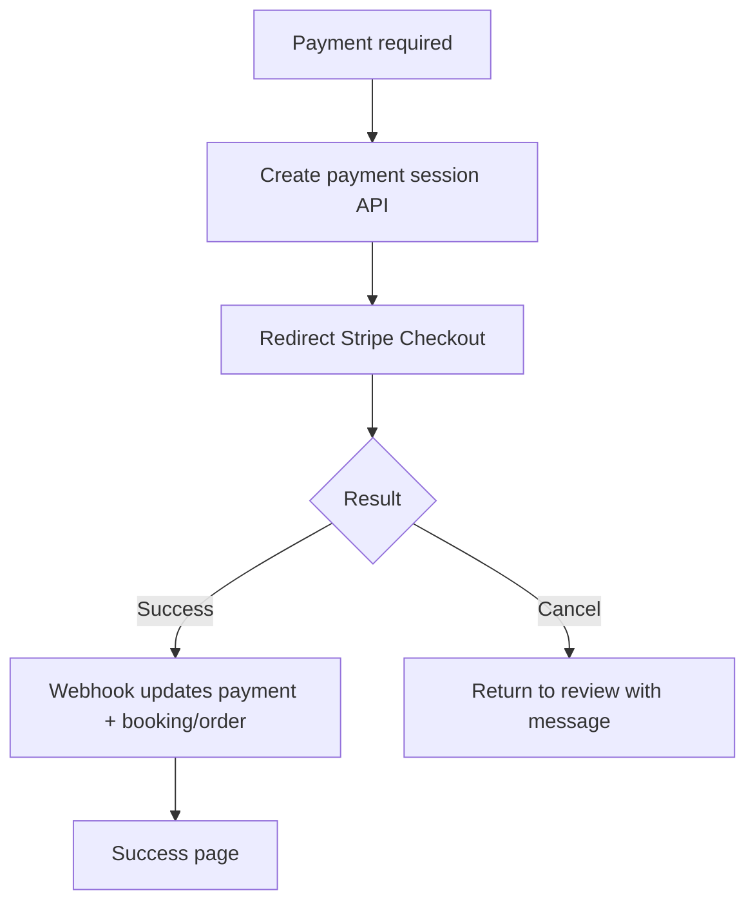
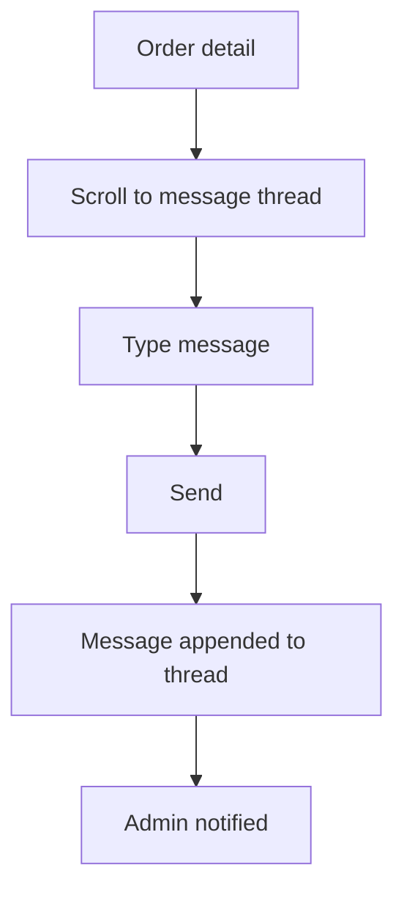
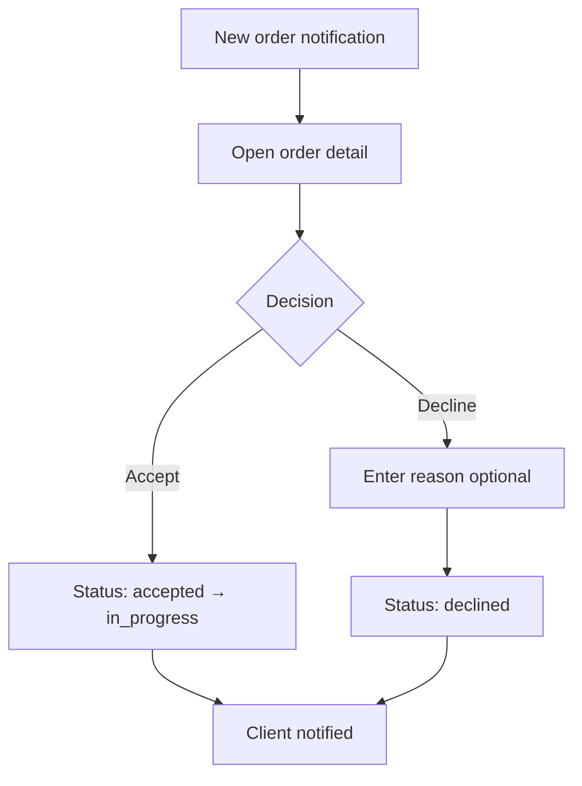

# Service Platform PWA — User Flows

All flows assume mobile-first UI unless noted. Business context is established via URL slug (`/b/{slug}`) or post-login business selection.

---

## Client Flows

### C1. Registration / Login



**Steps:**
1. Client opens business link (`https://app.example.com/b/joes-salon`).
2. Taps **Sign in** or continues as guest (if business allows).
3. **Sign up:** email, full name, phone (optional), password → account created → redirect to services.
4. **Log in:** email + password → JWT issued → redirect to intended page.
5. **Guest:** No account; contact info captured at confirmation step; can claim account later via email link (post-MVP).

**Business rules:**
- `allow_guest_checkout` setting (default: true on Free, configurable).
- One user account can be a client at multiple businesses (separate `clients` rows).

**Errors:**
- Invalid credentials → inline error, no lockout MVP (rate limit on API).
- Email already registered → offer login instead.

---

### C2. Choose Service

```mermaid
flowchart TD
    A[Client home] --> B{Business mode}
    B -->|booking_only| C[Show booking services]
    B -->|orders_only| D[Show order services]
    B -->|both| E[Tabs: Book appointment | Request service]
    C --> F[Tap service card]
    D --> F
    E --> F
    F --> G{Service type}
    G -->|booking| H[Booking flow C3]
    G -->|order| I[Order flow C4]
```

**Steps:**
1. Home shows business name, logo, short description.
2. Services listed as cards: name, duration (booking), price, short description.
3. Client taps a service → routed by `service.type`.

**Empty states:**
- No services → "No services available" + business contact info.

---

### C3. Create Booking



**Steps:**
1. **Service detail** — shows description, duration, price, cancellation policy summary.
2. **Date picker** — calendar; disabled dates = non-working days, full days, past dates.
3. **Time picker** — grid of available slots; greyed = unavailable.
4. **Review** — summary card + optional notes field.
5. **Payment** (if `service.price > 0` and `require_payment: true`) → Stripe Checkout.
6. **Confirm** — POST booking → status `pending`, `pending_payment` (if checkout required), or `confirmed` (based on `auto_confirm_bookings` business setting).
7. **Confirmation screen** — reference number, add to calendar link (ICS post-MVP), link to "My bookings".

**Validation:**
- Slot must still be available at submit (server-side lock).
- Client cannot book if monthly booking limit reached (platform plan).

**Errors:**
- Slot taken → return to time picker with message.
- Payment abandoned → booking stays `pending_payment` for 15 min then released.

---

### C4. Create Order / Request



**Steps:**
1. **Service detail** — description, estimated turnaround text, price (fixed or "quote on request").
2. **Order form** — dynamic fields: description (required), quantity, preferred contact method, custom fields.
3. **Review** — all entered data + price if fixed.
4. **Payment** (if configured) → Stripe Checkout.
5. **Submit** — order status `submitted`.
6. **Confirmation** — order reference, expected response time, link to "My requests".

**Business rules:**
- `price_type: fixed | quote` — quote orders have `price: null` until admin sets it (post-MVP payment on quote).

---

### C5. Pay



**Steps:**
1. Client taps **Pay** → backend creates Stripe Checkout Session with `booking_id` or `order_id` metadata.
2. Redirect to Stripe hosted page.
3. On success → redirect to `/payment/success?session_id=...` → poll or verify session → show confirmation.
4. On cancel → redirect to `/payment/cancel` → retry option.

**MVP:** No saved cards; one-time checkout only.

---

### C6. View My Bookings

**Steps:**
1. Client navigates **My bookings** from nav or profile.
2. Tabs or filters: **Upcoming** | **Past** | **Cancelled**.
3. Each card: service name, date/time, status badge, business name.
4. Tap card → **booking detail**: full info, cancel/reschedule buttons (if allowed).

**States shown:**
- `pending`, `pending_payment`, `confirmed`, `completed`, `cancelled`, `no_show`

---

### C7. View My Requests

**Steps:**
1. Client navigates **My requests**.
2. Filters: **Active** | **Completed** | **Declined**.
3. Each card: service name, submitted date, status, last message preview.
4. Tap card → **order detail** + message thread.

**States shown:**
- `submitted`, `pending_payment`, `accepted`, `in_progress`, `completed`, `declined`, `cancelled`

---

### C8. Write Message by Order



**Steps:**
1. Open order from "My requests".
2. Message thread shows chronological messages (client vs business labels).
3. Client types in input at bottom → **Send**.
4. Real-time update via polling (MVP) or WebSocket (post-MVP).
5. Admin receives notification.

**Rules:**
- Messaging only on orders, not bookings (MVP). Booking notes are one-way from client at creation.
- Cannot message on `declined` or `completed` orders (read-only thread).

---

### C9. Cancel / Reschedule Booking

**Cancel flow:**
1. Open booking detail → **Cancel booking**.
2. Confirm dialog with policy text ("Free cancellation until 24h before").
3. If within policy → status `cancelled`; slot released; confirmation email.
4. If outside policy → show "Contact business" or block (business setting).

**Reschedule flow:**
1. Open booking detail → **Reschedule**.
2. Return to date picker → time picker (same as C3).
3. Old slot released; new slot reserved on confirm.
4. Reschedule cutoff same as cancellation policy.

**Payment on cancel:**
- MVP: manual refund via Stripe dashboard; client sees "Refund processing" if admin triggers (post-MVP UI).

---

### C10. Receive Notification

**Channels:** Email (MVP), push (Phase 5).

**Client notification touchpoints:**
| Trigger | Content |
|---------|---------|
| Booking confirmed | Date, time, address |
| Reminder 24h | Same + reschedule link |
| Booking cancelled | By whom, reason |
| Order accepted | Next steps |
| Order declined | Reason |
| New message on order | Preview + link |
| Payment receipt | Amount, reference |

**In-app:** Notification bell with unread count (Phase 5); MVP email only.

---

## Admin Flows

### A1. Create Service

**Steps:**
1. Admin → **Services** → **Add service**.
2. Choose type: **Booking** or **Order** (cannot change after creation).
3. Fill: name, description, duration (booking only), price, price type (order: fixed/quote).
4. Options: active/inactive, require payment. (Auto-confirm is a **business** setting in `settings.auto_confirm_bookings`, not per-service.)
5. Save → service appears in client catalog.

**Validation:**
- Free plan: max 3 services.
- Duration required for booking type; min 15 min, max 480 min.

---

### A2. Manage Booking

**Steps:**
1. Admin → **Bookings** → list with date filter, status filter, search by client.
2. Tap booking → detail drawer/page.
3. Actions: **Confirm**, **Cancel**, **Mark completed**, **Mark no-show**, **Add internal note**.
4. Optional: **Create booking** manually (pick client, service, slot).

**List views:**
- Today (default on mobile dashboard)
- Week calendar (desktop)
- Table with sort (desktop)

---

### A3. Accept / Decline Order



**Steps:**
1. Admin sees pending orders on dashboard badge.
2. Opens order → reviews client details and form responses.
3. **Accept** → status `accepted` (or `in_progress` directly).
4. **Decline** → optional reason → status `declined`.
5. Client emailed automatically.

**Later:** Mark **Complete** when work done.

---

### A4. Message Client

**Steps:**
1. From order detail → message thread (same component as client view).
2. Admin sends reply → client notified.
3. Messages marked with `sender_type: admin`.

---

### A5. Manage Clients

**Steps:**
1. Admin → **Clients** → searchable list (name, phone, email).
2. Tap client → profile: contact info, admin notes, booking history, order history.
3. Actions: edit notes, view individual booking/order (read-only link).

**No delete client MVP** — soft archive post-MVP.

---

### A6. Manage Schedule

**Steps:**
1. Admin → **Schedule**.
2. **Working hours** — per weekday: open/close times (e.g. Mon–Fri 9:00–18:00).
3. **Breaks** — e.g. lunch 13:00–14:00 daily.
4. **Unavailable times** — add date ranges (vacation, holidays) with optional note.
5. Save → slot engine recalculates immediately.

**MVP:** Single schedule for whole business (no per-staff).

---

### A7. View Payments

**Steps:**
1. Admin → **Payments** → table: date, client, amount, type, linked booking/order, status.
2. Filter by status, date range.
3. Tap row → detail with Stripe payment ID (link to Stripe dashboard).

---

### A8. Configure Settings

**Sections:**
| Section | Fields |
|---------|--------|
| **Profile** | Business name, slug, description, logo |
| **Contact** | Phone, email, address |
| **Mode** | booking_only / orders_only / both |
| **Booking policies** | auto-confirm, cancellation hours, advance booking days |
| **Payments** | Stripe connect status, require payment default |
| **Notifications** | Email toggles per event |
| **Account** | Change password, plan usage, upgrade CTA |

---

## Superadmin Flows

### S1. Manage Businesses

**Steps:**
1. Superadmin → **Businesses** → table: name, slug, plan, status, created, owner email.
2. Search/filter by plan, status.
3. Tap row → business detail: usage stats, subscription, members, audit snippet.
4. Actions: change plan, view as read-only (post-MVP), impersonate support mode (logged).

---

### S2. Manage Subscriptions

**Steps:**
1. Superadmin → **Subscriptions**.
2. List all active subscriptions with plan, renewal date, payment status.
3. Override plan for a business (e.g. comp Pro for partner).
4. View platform MRR summary (basic counts MVP).

---

### S3. Disable / Enable Accounts

**Steps:**
1. From business detail → **Disable account**.
2. Confirm → business `status: suspended`; client booking page shows maintenance message; admin login blocked.
3. **Enable** reverses; data intact.

**Audit:** All superadmin actions logged to `audit_logs`.

---

## Cross-Cutting Flows

### X1. Plan Limit Hit

1. Business exceeds limit (e.g. 31st booking on Free).
2. API returns `403 PLAN_LIMIT_EXCEEDED`.
3. Client sees friendly error; admin sees upgrade banner with usage meter.

### X2. Onboarding (New Business)

1. Owner signs up at `/signup/business`.
2. Creates business name + slug + mode.
3. Guided checklist: add service → set hours → connect Stripe → share link.
4. Default Free plan applied.

### X3. PWA Install

1. Browser shows install prompt after 2nd visit.
2. Installed app opens to last business or business picker.
3. Offline: cached shell + "You're offline" on API failure.

---

## Flow Priority for MVP Implementation

| Priority | Flow ID | Reason |
|----------|---------|--------|
| P0 | C3, C4, A2, A3 | Core value loop |
| P0 | C1, A1, A6 | Prerequisites |
| P1 | C5, A7 | Revenue |
| P1 | C6, C7, C8 | Client retention |
| P1 | C9, C10 | Trust + reliability |
| P2 | S1–S3 | Platform ops |
| P2 | X2, X3 | Growth + UX polish |
